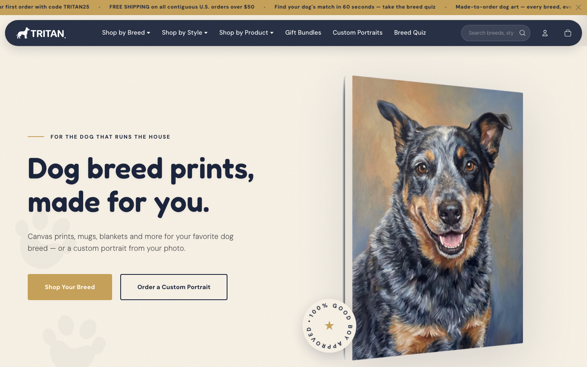
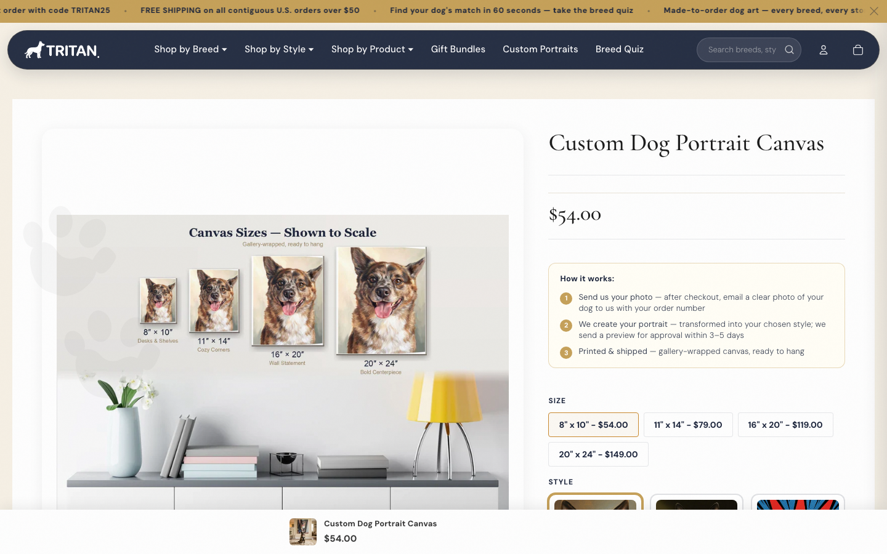

# Tritan

A print-on-demand storefront built from scratch and running on automation.

Live on **Shopify · Etsy · TikTok Shop · Instagram · Pinterest · Google**.

---

> [!NOTE]
> **Product Showcase & Architecture Repository**
> This repository contains the public documentation, architectural overview, and visual assets for the proprietary **Tritan Storefront**. The core codebase is closed-source.

---

## What it is

Tritan sells dog breed art — canvas prints, mugs, blankets, phone cases, stickers, and custom portraits. The catalog is large. The operation is lean. My job is upstream: watching trends, directing the art style, deciding what gets built. Once a product style locks in, the pipeline generates it across the full catalog. The rest is automated.

The model works because the effort doesn't grow with the output.

---

## Custom portraits

One of the strongest parts of the store. Customers upload a photo of their dog after checkout. An artist proof is sent before anything prints.

---

## Automated E-Commerce Pipeline

Tritan runs on a fully automated print-on-demand publishing and fulfillment engine, eliminating manual catalog overhead.

---

Built and operated by [Kyle Miller](https://github.com/kylemillerbuilds) · [Themis Foundry](https://themisfoundry.com)
